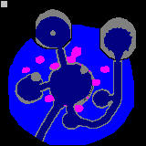

    
 Search Maps

     
    

      All areas have a search map, which controls where the player may walk and fly, the footstep sound while walking over certain areas, what terrain projectiles can pass and whether terrain blocks clearing of the fog of war. 
      The search map for BG2 is: 

| **Value** | **Description** | **Color**         | **Walk sound** | **Walkable** | **See through** | **Flyable** | **Projectiles** |
|:---------:|:---------------:|:-----------------:|:--------------:|:------------:|:---------------:|:-----------:|:---------------:|
| 0         | Obstacle        | Black             | /              | no           | no              | no          | no              |
| 1         | Sand            | Burgundy          | WAL_04         | yes          | yes             | yes         | yes             |
| 2         | Wood            | Dark Green        | WAL_MT         | yes          | yes             | yes         | yes             |
| 3         | Wood creaking   | Brown/Dark Yellow | WAL_02         | yes          | yes             | yes         | yes             |
| 4         | Stone echoey    | Dark Blue         | WAL_05         | yes          | yes             | yes         | yes             |
| 5         | Grass           | Purple            | WAL_06         | yes          | yes             | yes         | yes             |
| 6         | Water           | Turquoise         | WAL_01         | yes          | yes             | yes         | yes             |
| 7         | Stone           | Light Gray        | WAL_03         | yes          | yes             | yes         | yes             |
| 8         | Obstacle        | Dark Gray         | /              | no           | yes             | yes         | yes             |
| 9         | Wood creaking   | Red               | WAL_02         | yes          | yes             | yes         | yes             |
| 10        | Wall            | Bright Green      | /              | no           | no              | no          | no              |
| 11        | Water           | Yellow            | WAL_01         | yes          | yes             | yes         | yes             |
| 12        | Water           | Blue              | /              | no           | yes             | yes         | yes             |
| 13        | Roof            | Magenta           | /              | no           | no              | no          | no              |
| 14        | Worldmap exit   | Cyan              | /              | no           | yes             | yes         | yes             |
| 15        | Grass           | White             | WAL_04         | yes          | yes             | yes         | yes             |

      A sample search map (from ar0072) can be seen below.  
      

        
      

    

  

